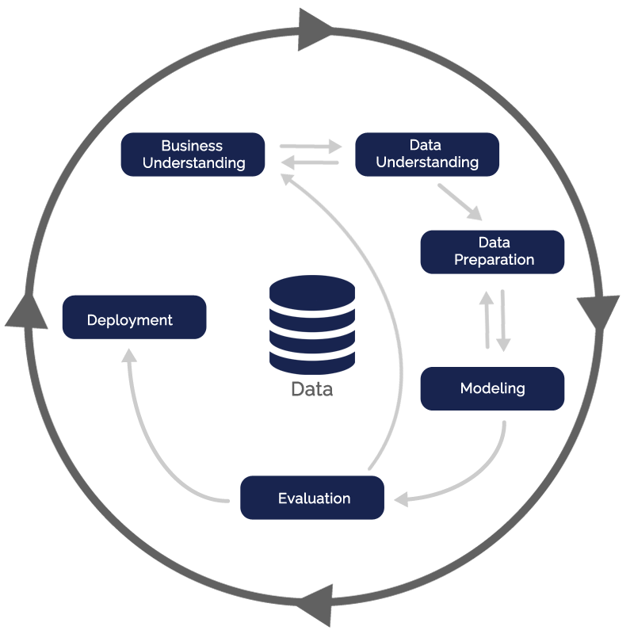

# Grupo-Bimbo-Inventory-Demand
Maximize sales and minimize returns of bakery products

	

This project is a demand forecast of a product for a given week using data pertaining to 9 weeks of sales transactions in Mexico. Each transaction can be either a sale or a return, the demand for a product in a given week is defined as the sales of this week subtracted by the return of the following week.

# Methodology
This project will be based on Cross-industry standard process for data mining (CRISP-DM). A standard idea about data science project may be linear: data preparation, modeling, evaluation and deployment. However, when we use CRISP-DM methodology a data science project become circle-like form. Even when it ends in Deployment, the project can restart again by Business Understanding. How might it help? It may help to avoid the data scietist to stop in one specific step and wast time on it. When all the project is completed the data scientist can return to initial step and do every step again. Therefore, the main goal it is to follow circles as it needs.

	

## Business Understanding
- Currently, daily inventory calculations are performed by direct delivery sales employees who must single-handedly predict the forces of supply, demand, and hunger based on their personal experiences with each store. With some breads carrying a one week shelf life, the acceptable margin for error is small. Therefore, the development of a model to accurately forecast stock demand based on historical sales data was requested.

> - **Solution Format:**
>> - Granularity: weekly sales transactions;
>> - Kind of problem: Demand Forecast;
>> - Main methods: Regression, Time Series;
>> - Delivering Method: 

## Data Understanding

- The dataset is available on <a href="https://www.kaggle.com/c/grupo-bimbo-inventory-demand/data">Kaggle</a>.

## Data Preparation

> **Data fields**
>> - Semana: Week number
>> - Agencia_ID: Sales Depot ID
>> - Canal_ID: Sales Channel ID
>> - Ruta_SAK: Route ID
>> - Cliente_ID: Client ID
>> - NombreCliente: Client name
>> - Producto_ID: Product ID
>> - NombreProducto: Product Name
>> - Venta_uni_hoy: Sales unit this week 
>> - Venta_hoy: Sales this week (unit: pesos)
>> - Dev_uni_proxima: Returns unit next week 
>> - Dev_proxima: Returns next week (unit: pesos)
>
> - **Demanda_uni_equil**: Adjusted Demand (This is the target to predict)

# Team
> - <a href="https://github.com/FabioCaffarello">Fabio Caffarello</a>
> - <a href="https://github.com/WilliamCutrim">William Cutrim da Silva</a>
